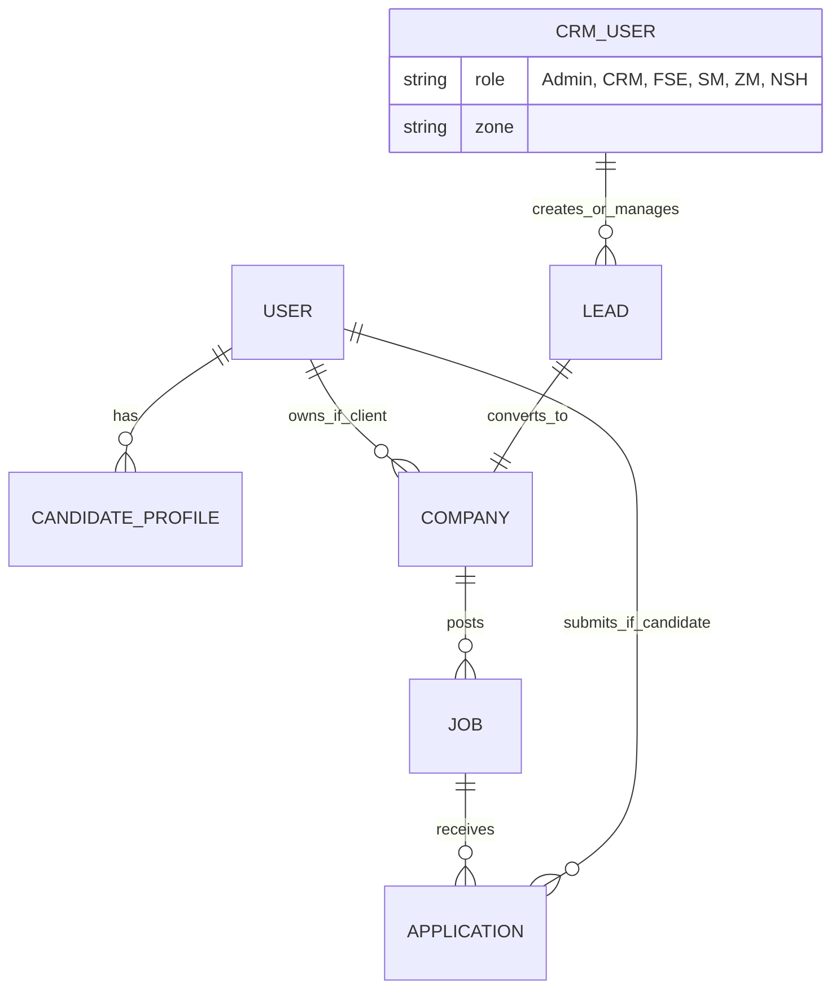
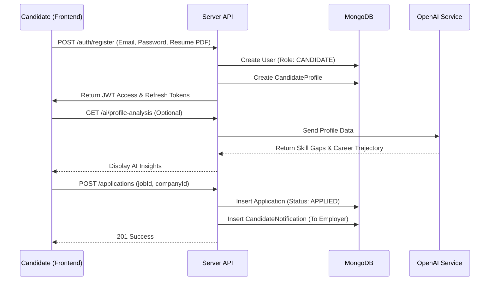
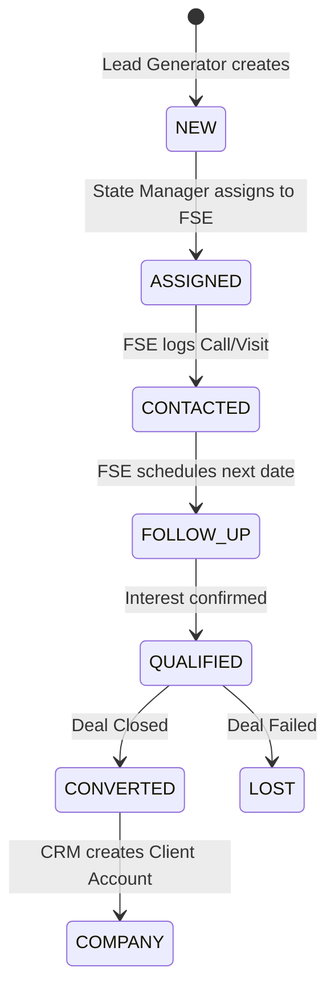
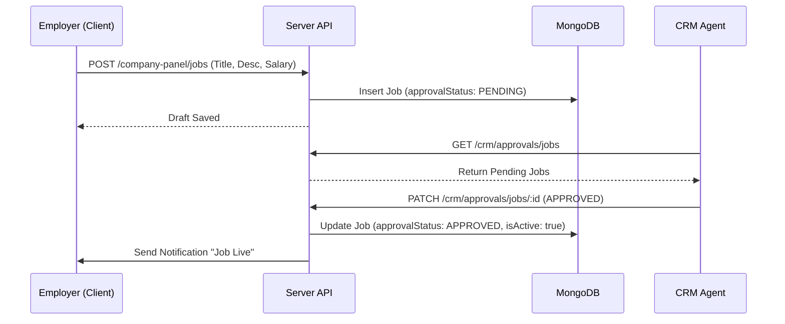

# Maven Jobs — Complete Master Documentation

> A full-stack, multi-module job portal and sales management platform.
> Built with **React (Vite)** across 13 separate frontend apps and a unified **Node.js / Express / MongoDB** backend API.

---

## 📦 1. Monorepo Overview — All 13 Modules

| # | Module | Directory | Purpose |
|---|--------|-----------|---------|
| 1 | **Portal** | `portal/` | Primary candidate + employer web app |
| 2 | **Admin** | `Admin/` | Internal admin panel |
| 3 | **CRM** | `CRM/` | CRM agent panel |
| 4 | **FSE** | `FSE/` | Field Sales Executive app |
| 5 | **Lead Generator** | `Lead-Generator/` | Lead generation agent app |
| 6 | **State Manager** | `State-Manager/` | Regional state-level manager app |
| 7 | **Zonal Manager** | `ZonalManager/` | Zone-level manager app |
| 8 | **National Sales Head** | `National-SalesHead/` | Top-level national sales overview app |
| 9 | **Candidate** | `Candidate/` | Standalone candidate mini-portal |
| 10 | **Company** | `Company/` | Standalone employer/company mini-portal |
| 11 | **QR-MavenJobs** | `QR-MavenJobs/` | Public QR code landing page (candidate registration) |
| 12 | **Company-QR** | `Company-QR/` | Company-specific QR landing page |
| 13 | **Server** | `server/` | Shared backend REST API |

---

## 🛠️ 2. System Architecture & Tech Stack

| Layer | Technology |
|-------|-----------|
| Frontend | React 18, Vite, React Router v6 |
| State Management | TanStack Query (portal), React Context (all apps) |
| Styling | Vanilla CSS, Tailwind CSS (portal), custom design systems per module |
| Backend | Node.js, Express.js |
| Database | MongoDB + Mongoose (43 models) |
| Auth | JWT Access + Refresh Tokens, Google OAuth 2.0 |
| AI | OpenAI GPT (resume, profile, skills, ATS analysis) |
| Real-time | Socket.IO (candidate-employer live chat) |
| Caching | Redis (route-level + service-level) |
| Storage | Cloudinary / AWS S3 (profile images, resumes, blog images) |
| Payments | Razorpay (orders, webhooks, refunds) |
| Email | Nodemailer (OTP, password reset, notifications) |
| Queue | Bull + Redis (background job processing) |
| Rich Text | Tiptap editor (blog editor in Admin) |
| PDF Export | html2canvas + jsPDF (zone/lead reports in sales apps) |

---

---

# 📱 MODULE 1 — Portal (`portal/`)

> The main user-facing web application for candidates and employers.

## Tech Stack (Portal)
- React 18 + Vite
- Tailwind CSS + Vanilla CSS
- TanStack Query v5 for all server state
- React Router v6
- Socket.IO client

---

## 🌐 All Routes

### Public Routes
| Path | Component | Description |
|------|-----------|-------------|
| `/` | `NaukriLandingPage` | Candidate landing page — job search, trending roles, popular companies, stats |
| `/employer-login` | `EmployerLandingPage` | Employer-facing landing — product features, pricing overview, employer testimonials |
| `/jobs` | `JobListingPage` | Browse & filter all job listings |
| `/jobs/:filter` | `JobListingPage` | Pre-filtered job listing (e.g. by role, city) |
| `/job/:id` | `JobDetailsPage` | Full job detail — JD, skills, salary, company info, apply button |
| `/companies` | `CompaniesPage` | Browse and filter companies |
| `/companies/:filter` | `CompaniesPage` | Filtered company listing |
| `/company/:id` | `Jobprofile` | Company profile page — about, culture, open roles, reviews |
| `/salary-insights` | `SalaryInsights` | Salary data by role, industry, city |
| `/salary-calculator` | `SalaryCalculator` | Interactive salary estimation tool |
| `/interview-questions` | `InterviewQuestions` | Interview prep content by company/role |
| `/blogs` | `Blogs` | All published blog posts |
| `/blogs/:slug` | `BlogArticle` | Individual blog article view |
| `/blog-article` | `BlogAIRex` | AI-enhanced blog explorer (Blogsx.jsx) |
| `/sitemap` | `CandidateSitemap` | Full site map for candidates |
| `/mj/:shareId` | `PublicProfileByShareId` | Publicly shareable candidate profile via share link |
| `/candidates/:candidateId` | `PublicCandidateProfile` | Public-facing candidate profile page |
| `/review/:reviewId` | `ReviewSharePage` | Shared employer review public page |
| `/info` | `Info` | Platform information page |
| `/company/:slug/info` | `FooterPage` | Company-specific information footer page |
| `/buy-online` | `Buyonline` | Buy premium plans online |
| `/services` | `Services` | All premium services listing |
| `/services/text-resume` | `TextResume` | Text resume writing service |
| `/services/visual-resume` | `VisualResume` | Visual resume design service |
| `/services/resume-critique` | `ResumeCritique` | Expert resume critique service |
| `/services/resume-maker` | `ResumeMaker` | Resume maker service |
| `/services/resume-quality-score` | `ResumeQualityScore` | Resume quality score service |
| `/services/resume-samples` | `ResumeSamples` | Free resume sample library |
| `/services/job-letter-samples` | `JobLetterSamples` | Cover letter and offer letter samples |
| `/services/jobs4u` | `Jobs4u` | Personalized job matching service |
| `/services/priority-applicant` | `PriorityApplicant` | Priority applicant service |
| `/services/contact-us` | `ContactUs` | Contact support form |
| `/services/resume-display` | `ResumeDisplay` | Resume display/featured service |
| `/services/monthly-subscriptions` | `MonthlySubscriptions` | Monthly plan subscription listing |
| `/services/basic-and-premium-plans` | `BasicPremiumPlans` | Plan comparison page |
| `/pro` | `MavenPro` | MavenPro premium subscription page |
| `/premium` | `Premium` | Premium plans and features |
| `/leave` | `Leave` | Leave/cancel subscription page |
| `/expert-assist` | `ExpertAssist` | Expert career assistance (Artist.jsx) |
| `/talent-pulse` | `Talent` | Talent insights for employers |
| `/branding` | `Branding` | Employer branding solutions |
| `/job-posting` | `JobPosting` | Job posting product page |
| `/hiring-automation` | `HiringAutomation` | Hiring automation product page |
| `/employer-help` | `EmployerHelp` | Employer help and support |
| `/jobs/info` | `JobsInfo` | Jobs information page |

### Protected Candidate Routes
| Path | Component | Description |
|------|-----------|-------------|
| `/dashboard` | `HomeDashboard` | Main candidate home dashboard |
| `/profile` | `ProfileDashboard` | Full profile editor |
| `/saved-jobs` | `SavedJobs` | All saved/bookmarked jobs |
| `/daily-quiz` | `DailyQuiz` | Daily engagement quiz |
| `/mivites` | `MIvitesPage` | Maven Invites — recruiter invitations |
| `/resume-builder` | `ResumeBuilder` | Interactive resume builder |
| `/resume-view` | `ResumeView` | Resume preview page |
| `/profile/resume` | `ResumeViewer` | Resume viewer + download |

### Protected Employer Routes
| Path | Component | Description |
|------|-----------|-------------|
| `/post-job` | `PostJob` | Create & post a new job |
| `/employer-draft-jobs` | `DraftJobs` | Manage draft/unpublished jobs |
| `/employer-dashboard` | `EmployerDashboard` | Full employer management dashboard |
| `/employer-dashboard/analytics` | `AnalyticsPage` | Employer analytics + job performance |
| `/employer-dashboard/pricing` | `Pricing` | Manage subscription pricing/plans |
| `/employer-dashboard/folders` | `FolderListPage` | Candidate folder management |
| `/employer-dashboard/folders/:folderId` | `SingleFolderPage` | Single folder — candidates inside |
| `/resdex` | `SearchResume` | Resume database (ResDex) search |
| `/resdex/search-results` | `SearchResults` | Search results from ResDex |
| `/manage-search` | `ManageSearch` | Saved resume searches |

---

## 👤 Candidate — Home Dashboard (`/dashboard`)

**File:** `HomeDashboard.jsx` — 2,200+ lines

### 3-Column Layout

#### Left Sidebar
| Widget | Description |
|--------|-------------|
| **Profile Card** | Avatar, name, headline, location, skills, profile completion % bar |
| **PremiumX Banner** | Upgrade CTA to `/pro` |
| **Quick Links** | Smooth-scroll tab navigation (Home, Jobs, Company, MIvites) |
| **MIvites Card** | Recruiter invitation preview with `mailIcon.png` branding; link to `/mivites` |

#### Center Content Sections
| Section | ID | Features |
|---------|----|---------|
| **Recommended for You** | `#section-recommended` | 4 tabs: Profile / Applies / You might like / Preferences. Horizontally scrollable job cards |
| **Preferences Tab (empty state)** | — | Shows "Get the best job recommendations..." CTA + "Update career preferences" blue button when no preferences set |
| **Preferences Tab (with jobs)** | — | Shows matched jobs + "Edit" button in tab row |
| **Jobs from Followed Companies** | `#section-followed` | Jobs from companies candidate follows; "Follow more" link |
| **Apply Match — Last 7 Days** | `#section-applymatch` | Jobs matched to recent application history |
| **Top Companies for You** | `#section-topcompanies` | Curated top hiring companies from backend API |
| **Recommended Blogs** | `#section-blogs` | Latest published blog spotlight card (cover image, category, title, excerpt, "Read" CTA) |
| **MIvites Section** | `#section-nvites` | Full maven invite list with status |

#### Right Sidebar
| Widget | Description |
|--------|-------------|
| **In Demand / Popular Job Roles** | Trending job roles card |
| **Promoted / Sponsored Companies** | Sponsored company listings |
| **Latest Blog Card** | Most recent blog post — cover image, title, excerpt, "Read more" button |

---

## 👤 Candidate — Profile Dashboard (`/profile`)

**File:** `ProfileDashboard.jsx` — 4,500+ lines, `ProfileDashboard.css` — 4,000+ lines

### Profile Sections
| Section | Fields & Capabilities |
|---------|----------------------|
| **Basic Info** | Name, email, phone, alt phone, headline, summary, total experience, notice period |
| **Location** | Current city, state, country; preferred locations |
| **Work Experience** | Add / Edit / Delete; current company toggle; role, company, duration, description |
| **Education** | Degree, institution, year, percentage/CGPA; multiple entries |
| **Skills** | Add/remove skills; AI-powered autocomplete suggestions |
| **Projects** | Title, description, URL, tech stack, media image upload |
| **Certifications** | Certificate name, issuing org, date, credential URL |
| **Languages** | Language + proficiency level (beginner to native) |
| **Social Links** | LinkedIn, GitHub, portfolio URL; validation |
| **Achievements** | Awards, publications, accomplishments |
| **Career Preferences** | Preferred roles, locations, salary range, employment type (full-time/part-time/contract/remote) |
| **Resume Upload** | PDF upload up to 8MB; view/download/delete |
| **Profile Photo** | Upload and display profile image |

### AI Features in Profile
| Feature | Description |
|---------|-------------|
| **AI Skill Suggestions** | Analyzes profile and suggests relevant skills to add |
| **AI Resume Enhance** | Rewrites resume bullet points for clarity and impact |
| **ATS Score** | Scores resume against ATS standards, lists missing keywords |
| **Resume Analyze** | Full resume breakdown with section-by-section tips |
| **AI Profile Analysis** | Returns: career trajectory, skill gaps, recommended roles, recommended skills, market demand, salary range estimate, next steps |
| **Profile Completion Score** | Percent complete based on sections filled |
| **Profile History** | View snapshot history of past profile changes |

---

## 💼 Candidate — Job Features

### Job Listing Page (`/jobs`)
**File:** `JobListingPage.jsx` — 2,000+ lines

| Feature | Description |
|---------|-------------|
| **Search** | Full-text search by title, skill, company |
| **Location Filter** | City-based filter with autocomplete |
| **Experience Filter** | Entry level / Mid / Senior / Manager |
| **Salary Filter** | Min-max salary range filter |
| **Job Type Filter** | Full-time / Part-time / Contract / Remote / Internship |
| **Department Filter** | Role-category based filtering |
| **Date Posted Filter** | Last 24h / 3 days / 7 days / 30 days |
| **Sorting** | Relevance, Newest, Salary |
| **Pagination** | Server-side with page navigation |
| **Save/Unsave Toggle** | Bookmark jobs from listing |
| **AI Match Badge** | Lazy-loaded AI match % per job card |
| **Quick Apply** | Express interest / one-click apply from listing |
| **Applied Status** | Shows "Applied" badge on already-applied jobs |

### Job Details Page (`/job/:id`)
**File:** `JobDetailsPage.jsx` — 1,500+ lines

| Feature | Description |
|---------|-------------|
| **Full JD** | Description, responsibilities, requirements |
| **Company Info** | Logo, name, rating, size, location |
| **Skills Required** | Skill tags |
| **Salary Display** | Min-max salary range |
| **Apply Button** | Resume-select modal + application submission |
| **Save Job** | Bookmark button |
| **Express Interest** | Single-click interest flag to recruiter |
| **Similar Jobs** | Backend-generated similar job recommendations |
| **AI Match Score** | Full AI match score for this specific job |
| **Share Job** | Copy link functionality |

### Saved Jobs (`/saved-jobs`)
- View all bookmarked jobs
- Remove from saved
- Direct apply from saved list

### Salary Insights (`/salary-insights`)
- Industry and role-based salary data
- Comparison charts

---

## 🏢 Company Features

| Feature | Description |
|---------|-------------|
| **Company Listing** (`/companies`) | Browse companies; filter by industry, size, city, rating |
| **Company Profile** (`/company/:id`) | About, headcount, founded year, culture, open positions, reviews |
| **Follow / Unfollow** | Follow to receive job updates on dashboard |
| **Company Reviews** | Submit star rating + written review |
| **Company Stats** | Aggregated total jobs, hiring rate |
| **Company Filter Options** | Industry, location, company size dropdown |

---

## 📋 Resume Features (`/resume-builder`)

**File:** `ResumeBuilder.jsx` — 4,000+ lines

| Feature | Description |
|---------|-------------|
| **Section-by-section editor** | Work experience, education, skills, certifications, projects |
| **Multiple Templates** | Select from pre-designed resume templates |
| **Dynamic Templates** | AI-enhanced animated template switcher |
| **Live Preview** | Real-time preview as user types |
| **PDF Export** | Server-generated PDF download |
| **Resume View** (`/resume-view`) | Preview final generated resume |
| **Resume Viewer** (`/profile/resume`) | View uploaded resume, download button |

---

## 🤖 AI System (Frontend)

**Files:** `LazyAI.jsx`, `aiService.js`, `useLazyAI.js`, `useProfileAnalysis.js`

| Component / Hook | Purpose |
|---------|---------|
| `LazyAIMatchScore` | Job match score badge — loads when card enters viewport via IntersectionObserver |
| `LazyAIComponent` | Generic wrapper for any AI-driven content with lazy loading |
| `useLazyAI` | Hook managing visibility detection, async AI fetch, loading/error state, caching |
| `aiService.js` | Class-based AI client with: request deduplication, in-memory caching (10 min TTL), abort controller, retry, uses `api.js` axios instance for correct base URL + auth |
| `useProfileAnalysis` | Hook for profile analysis AI state |

---

## 🎓 Daily Quiz (`/daily-quiz`)

**File:** `DailyQuiz.jsx`

| Feature | Description |
|---------|-------------|
| **Quiz Questions** | Multiple-choice questions with timer |
| **Submit Answers** | Submit and receive immediate score feedback |
| **Leaderboard** | Global quiz ranking (`/quiz/ranking`) |
| **Session Guard** | Shows quiz popup once per session, 1.5s after login |
| **Quiz Notification Popup** | `DailyQuizNotification.jsx` — timed modal with 10-second countdown |
| **Result History** | Per-candidate quiz attempt history stored |

---

## 📧 MIvites — Maven Invites (`/mivites`)

**Files:** `MIvitesPage.jsx`, `NVites.jsx`

| Feature | Description |
|---------|-------------|
| **Invitation Listing** | All recruiter/company invitations |
| **Status Indicators** | Pending / Accepted / Expired badges |
| **mailIcon.png Branding** | Custom icon from assets folder |
| **Dashboard Integration** | Left sidebar card on Home Dashboard |
| **Full Page** | Dedicated `/mivites` page with full invite list |

---

## 📝 Blog Features

**Files:** `Blogs.jsx`, `BlogArticle.jsx`, `Blogsx.jsx`

| Feature | Description |
|---------|-------------|
| **Blog Listing** (`/blogs`) | Grid of all published blog posts with pagination |
| **Blog Article** (`/blogs/:slug`) | Full article with rich text, cover image, category, date |
| **AI Blog Explorer** (`/blog-article`) | AI-enhanced blog discovery (`Blogsx.jsx`) |
| **Dashboard Blog Spotlight** | Center section on dashboard — most recent blog in large rich card |
| **Dashboard Blog Sidebar** | Right sidebar compact blog card — title, image, excerpt, "Read more" |
| **Categories** | IT, English, Career, Technology, Interview Tips, Resume & Cover Letter, Salary & Growth, Remote Work, Product Updates |

---

## 🔐 Authentication

**Files:** `AuthContext.jsx`, `authService.js`, `api.js`

| Feature | Description |
|---------|-------------|
| **Register** | Email + password + optional resume upload |
| **Login** | Email/password returning access + refresh JWT |
| **Google OAuth** | One-click Google sign-in |
| **Auto Token Refresh** | Silent refresh on 401 via Axios interceptor |
| **Session Expiry Events** | Custom event `candidate-session-expired` |
| **Password Reset** | OTP sent to email, verify, reset |
| **Employer Auth** | Separate token key (`employerToken`) with independent refresh |
| **Protected Routes** | `ProtectedRoute` wrapper for candidate routes |
| **Protected Employer Routes** | `ProtectedEmployerRoute` wrapper for employer routes |

---

## 🏢 Employer Dashboard (`/employer-dashboard`)

**File:** `Dashboards.jsx` — 10,000+ lines

### KPI Overview
| Metric | Description |
|--------|-------------|
| Total Jobs Posted | Count of active/expired postings |
| Total Applications | All candidate applications received |
| Total Views | Job listing view count |
| Shortlisted Candidates | Count of shortlisted applicants |

### Job Management (`ManageJobsResponses.jsx`)
| Feature | Description |
|---------|-------------|
| **Post Job** (`/post-job`) | Full job form: title, JD, required skills, salary range, location, job type, department, openings, deadline |
| **Edit Job** | Update any field on existing job |
| **Close/Pause Job** | Toggle job active/inactive |
| **Draft Jobs** (`/employer-draft-jobs`) | Save incomplete jobs; resume editing later; tab synced to URL (`?tab=drafts`) |
| **Job Performance** | Per-job views, applications, conversion rate |
| **Job List Tabs** | Switch between All Jobs (`?tab=all`) and Draft Jobs (`?tab=drafts`) |
| **Client-side Dynamic Filters** | Filters (Status, Category, Posted By) are generated from fetched data via `generateFiltersFromData()`; all filtering done in-browser via `queryLocalJobs()` — no separate filter endpoint needed |
| **Filter Sidebar** | Sticky sidebar with internal scroll; collapses when content exceeds viewport height |
| **Multi-select Filters** | Status, Category, and Posted By filters support multiple selections simultaneously |
| **Search** | Full-text search across job title and location |
| **Sorting** | By date (newest first), total responses (most first), or title (A–Z) |
| **Pagination** | Configurable page size (default 60); server-side slicing done locally |
| **Bulk Actions** | Select multiple jobs; available bulk operation toolbar |
| **Row Action Menu** | Per-job dropdown for edit, close, view responses |

### Application Management (`JobResponsesDetail.jsx`)
| Feature | Description |
|---------|-------------|
| **View Applications** | All applications per job with candidate details; fetched via `employerJobService.getJobDetailWithResponses(jobId)` |
| **Primary Status Tabs** | Tabs: All / Shortlisted / Maybe / Rejected — counts update live from local state as actions are taken |
| **Sub-filter Pills** | Secondary filters: All / New responses / Not viewed / Action pending — computed dynamically from live candidate state |
| **Candidate Action Buttons** | Per-card Shortlist / Maybe / Reject buttons; call `handleUpdateStatus()` which updates backend and immediately reflects in local state |
| **Action Visual Indicator** | When a status action is taken, the corresponding button shows a circular checkmark badge (`.jrd-action-active-badge`) in its top-left corner and adopts an active filled-background style |
| **Status Pipeline** | Move applicant through: Applied → Shortlisted / Maybe / Rejected |
| **Bulk Shortlist / Reject** | Toolbar bulk actions via `handleBulkShortlist()` and `handleBulkReject()` |
| **Candidate Filters Sidebar** | Sticky sidebar with internal scroll; filters are fully client-side, generated from candidate data returned by the API |
| **Client-side Dynamic Filters** | 12 accordion filter sections: Keywords, Location, Locality, Experience (histogram + range), Notice Period, Salary (range + "not mentioned"), Education, Diversity, Industry, Designation, Company, Department, Institute |
| **Filter Counts** | Each accordion shows a blue count badge for active selections; "Clear all (N)" button shows when any filter is active |
| **Keyword Search** | Search across candidate name, role, and skills; option to restrict to key skills only |
| **AI Recommendations** | Toggle to filter only AI-recommended candidates; count shown if any exist |
| **Contact Reveal** | Click to reveal phone number; copies to clipboard automatically |
| **WhatsApp Message** | Opens WhatsApp web with pre-filled message to candidate |
| **Email** | Opens system mail client with subject pre-filled for the job |
| **Call from App** | Opens device dialer via `tel:` link |
| **Outreach / Call Status** | Dropdown to set call status per candidate (e.g. Called, Interested, Not Answered) |
| **Comments** | Expandable comment panel per candidate; supports multiple comments with author name and timestamp; Ctrl+Enter to submit |
| **Not Viewed Tracking** | `handleMarkAsViewed()` updates `isViewed` on backend silently when contact is revealed |
| **NVite Insights Bar** | Header shows sent count, view rate, and response rate from the last 90 days |
| **Download Resume** | Preview and download candidate resume from within dashboard |

### ResDex — Resume Database (`/resdex`)
| Feature | Description |
|---------|-------------|
| **Full-text Search** | Search across all candidate profiles |
| **Filters** | Skills, years of experience, location, education level, notice period |
| **Saved Searches** | Save and name search queries; access from `/manage-search` |
| **Profile Preview** | View candidate profile inline |
| **Download Resume** | Direct resume access (credit-gated) |
| **Candidate Unlock** | `UnlockDatabaseModal` — use credits to access full contact details |

### Folders (`/employer-dashboard/folders`)
| Feature | Description |
|---------|-------------|
| **Create Folder** | Name and create candidate shortlist folders |
| **Add Candidates** | Add candidates from ResDex to folders |
| **View Folder** (`/folders/:folderId`) | All candidates in a single folder |
| **Remove from Folder** | Remove individual candidates |
| **Delete Folder** | Remove entire folder |

### Analytics (`/employer-dashboard/analytics`)
| Feature | Description |
|---------|-------------|
| **Job Funnel Chart** | Applications → Shortlisted → Interview → Hired conversion |
| **Views Over Time** | Graph of job listing views |
| **Top Performing Jobs** | Jobs with highest application rate |
| **Department Breakdown** | Applications by department |

### Pricing (`/employer-dashboard/pricing`)
| Feature | Description |
|---------|-------------|
| **Current Plan** | Shows active plan (Standard / Premium / Elite) |
| **Plan Comparison** | Feature table across plans |
| **Upgrade Request** | Submit plan change request to CRM |
| **Credit Balance** | View remaining credits |
| **Credit Transaction History** | All credit usage logs |

### Payment (`/buy-online`)
| Feature | Description |
|---------|-------------|
| **Razorpay Integration** | Initiate payment for premium plans |
| **Order Creation** | Backend creates Razorpay order |
| **Payment Verification** | Webhook + server-side verification |
| **Payment History** | View all past transactions |

### Reviews
| Feature | Description |
|---------|-------------|
| **View Reviews** | See all reviews submitted by candidates |
| **Review Share Page** | Public shareable review URL (`/review/:reviewId`) |

### Chat
| Feature | Description |
|---------|-------------|
| **ChatModal** | Full-featured real-time chat modal with candidate |
| **EliteChatWidget** | Floating chat access button |
| **Chat Threads** | Persistent conversation history |
| **Message History** | Scroll through past messages |
| **Read Status** | Mark thread as read |

---

## 🔔 Notifications

| Feature | Description |
|---------|-------------|
| **In-app Notifications** | Application updates, invite received, messages |
| **Mark as Read** | Per-notification read toggle |
| **Notification Preferences** | Configure which types of emails/notifications to receive |

---

## 🗂️ Frontend Services (`portal/src/services/`)

| File | Purpose |
|------|---------|
| `api.js` | Axios instance: base URL, auth header inject, silent refresh on 401, session expiry events |
| `authService.js` | All candidate/employer: auth, profile, jobs, applications, notifications, AI calls, quiz |
| `aiService.js` | AI service class: request dedup, in-memory cache, abort, axios-based |
| `paymentService.js` | Razorpay order creation and payment verification |
| `applicationService.js` | Job application helpers |
| `resumeService.js` | Resume upload utilities |
| `draftJobService.js` | Employer draft job localStorage persistence |

---

## 🪝 Custom Hooks (`portal/src/hooks/`)

| Hook | Purpose |
|------|---------|
| `useCandidateQueries` | All TanStack Query data fetchers for candidate |
| `useCandidateMutations` | Mutation hooks (apply, save, update, upload) |
| `useLazyAI` | IntersectionObserver + async AI state |
| `useJobFilters` | Job listing filter state management |
| `useCompanyFilters` | Company listing filter state |
| `useJobApplication` | Apply flow state: modal, resume select, submit |
| `useFolderQueries` | Employer candidate folder queries |
| `useLandingQueries` | Landing page data (trending jobs, stats, popular roles) |
| `useProfileAnalysis` | Profile AI analysis state |
| `useEmployerAuth` | Employer auth and session state |
| `useIndianCities` | Indian city data for location autocomplete |
| `useAuthGate` | Protected route auth verification hook |

---

## 📸 UI Components (`portal/src/components/`)

| Component | Purpose |
|-----------|---------|
| `LazyAI.jsx` | `LazyAIMatchScore`, `LazyAIComponent` — lazy AI renders |
| `Skeleton.jsx` | `SkeletonJobCard`, `SkeletonBlogCard`, `SkeletonProfile` — loading placeholders |
| `ProfileWidget.jsx` | Compact profile sidebar card |
| `ChatModal.jsx` | Real-time chat modal with Socket.IO |
| `NVites.jsx` | Maven Invites display card |
| `DailyQuizNotification.jsx` | 10-second countdown quiz popup |
| `LocationAutocomplete.jsx` | Autocomplete city input |
| `SearchAutocomplete.jsx` | Job title search with suggestions |
| `ResumeTemplate.jsx` | Resume template renderer |
| `DynamicResumeTemplates.jsx` | Animated template switcher |
| `EarlyAccessModal.jsx` | Feature gating modal for early access |
| `UnlockDatabaseModal.jsx` | Credit-based ResDex unlock modal |
| `Premium3D.jsx` | 3D animated premium showcase |
| `HourglassLoader.jsx` | Animated loading indicator |
| `CandidateResumeModal.jsx` | Resume selection modal during apply |
| `ProfileModals.jsx` | Shared profile section edit modals |
| `AvatarDropdown.jsx` | User avatar + dropdown menu |
| `DashboardIdentityHeader.jsx` | Header with user name and role |
| `FollowingCompanies.jsx` | Followed companies widget |
| `EliteChatWidget.jsx` | Floating chat button |
| `CandidateSearchBar.jsx` | Candidate-side search bar with filters |

---

---

# 🛡️ MODULE 2 — Admin Panel (`Admin/`)

> Internal admin tool for platform oversight, user management, role governance, blog publishing, and payment tracking.

## Pages

### Dashboard (`AdminDashboard.jsx`)
| KPI Card | Description |
|----------|-------------|
| Total Clients | Visible companies in admin portfolio |
| Total Job Postings | Live job volume |
| Total Candidates | Candidate profiles on platform |
| Total Applications | Applications across all jobs |
| Over-limit Clients | Clients with jobs exceeding package limits |

**Additional Widgets:**
- Recent activity log
- Quick navigation to Users, Roles, Blogs
- System status indicators

---

### Users Management (`UsersPage.jsx`)

| Feature | Description |
|---------|-------------|
| **User Listing** | All users across roles: ADMIN, CRM, FSE, CLIENT, CANDIDATE |
| **Search** | Full-text search across name, email, scope, department |
| **Filter by Role** | INTERNAL (ADMIN/CRM/FSE), ALL, CLIENT, CANDIDATE |
| **Filter by Status** | ALL, ACTIVE, PENDING_INVITE, RESTRICTED |
| **Create User** | Drawer form: full name, email, role, department, scope, status, password |
| **Edit User** | Update all fields including role and status |
| **Delete User** | Remove user with confirmation |
| **User Metrics** | Count of active, pending, restricted users |

---

### Roles Management (`RolesPage.jsx`)

| Feature | Description |
|---------|-------------|
| **List Roles** | All custom and system roles |
| **Search Roles** | Search by role name |
| **Create Role** | Name, scope (Custom), description |
| **Permission Matrix** | Per-role actions: view / create / edit / delete / approve / export |
| **Permission Domains** | users, roles, companies, jobs, candidates, applications, reports, settings |
| **Assign Role to User** | Select user + assign specific role |
| **Update Permissions** | Toggle individual permission per domain/action |

---

### Blog Management (`BlogsPage.jsx` + `BlogEditorPage.jsx`)

| Feature | Description |
|---------|-------------|
| **Blog List** | All blogs with search, status filter (published / draft), category filter |
| **Pagination** | 15 blogs per page with navigation |
| **Status Toggle** | Publish / Unpublish individual blog posts |
| **Delete Blog** | With confirmation dialog |
| **Create Blog** | Navigate to rich editor |
| **Edit Blog** | Full editor with existing content loaded |

**Blog Editor (`BlogEditorPage.jsx`) — Tiptap-powered:**
| Feature | Description |
|---------|-------------|
| **Rich Text** | Bold, italic, underline, strikethrough |
| **Headings** | H1, H2 |
| **Lists** | Ordered and unordered lists |
| **Blockquote** | Quote block |
| **Code** | Inline code |
| **Links** | Insert/edit hyperlinks |
| **Images** | Inline image insertion with upload |
| **Text Alignment** | Left, center, right |
| **Undo/Redo** | Full history navigation |
| **Metadata Fields** | Title, slug (auto-generated), excerpt, category, cover image upload |
| **Save as Draft** | Save without publishing |
| **Publish** | Publish immediately |
| **Categories** | IT, English, Career, Technology, Interview Tips, Resume & Cover Letter, Salary & Growth, Remote Work, Product Updates |

---

### Payments (`PaymentsPage.jsx`)

| KPI Card | Description |
|----------|-------------|
| Total Revenue | Lifetime all-time revenue |
| This Month | Current month revenue |
| This Year | Current calendar year revenue |
| By Candidates | Revenue from candidate PRO/ELITE subscriptions |
| By Employers | Revenue from employer (client) subscriptions |

**Payment Table:**
- Transaction ID (copyable)
- User / Company name
- Amount
- Status: PAID / CREATED / FAILED / REFUNDED / EXPIRED
- Payment date and type

---

### Admin Section (`AdminSection.jsx`)
- Platform-wide settings management
- Configuration toggles

---

---

# 📋 MODULE 3 — CRM Panel (`CRM/`)

> CRM agent panel for managing client accounts, job approvals, QR codes, candidate applications, packages, and notifications.

## Pages

### Dashboard (`CrmDashboard.jsx`)

| KPI Metric | Description |
|------------|-------------|
| Client Accounts | Total managed client/company records |
| Job Postings | Published + client-submitted roles |
| Pending Approvals | Client jobs awaiting CRM review |
| QR-enabled Clients | Clients with active QR kits |

**Dashboard Tabs:**
- **Client / Candidate** platform toggle
- **Package Type Filter:** Standard / Premium / Elite
- Recent job listings with quick-approve action
- Recent QR code activity

---

### Clients Management (`ClientsPage.jsx`)

| Feature | Description |
|---------|-------------|
| **Client List** | All company/employer accounts |
| **Metrics** | Total clients, active jobs, open positions |
| **Search** | Search by company name |
| **Create Client** | Full form: company name, industry, email, phone, address, state, city, pincode, about, package type, website |
| **Industry Options** | IT Services, Software/SaaS, Healthcare, Education, Retail, E-commerce, Finance, Manufacturing, Logistics, Hospitality, Real Estate, Media |
| **Edit Client** | Update all company fields |
| **Update Credentials** | Reset login email/password for client |
| **Assign Package** | Set Standard / Premium / Elite plan |
| **QR PDF Download** | Download client's QR code kit as PDF |
| **Input Validation** | Email format, 10-digit phone, required fields |

---

### Applications (`ApplicationsPage.jsx`)

| Feature | Description |
|---------|-------------|
| **All Applications** | View candidate applications across all clients |
| **Filter by Status** | Applied, Screening, Shortlisted, Interview, Offered, Hired, Rejected |
| **Search** | Search by candidate name / job title |
| **View Details** | Full application info modal |

---

### Approvals (`ApprovalsPage.jsx`)

| Feature | Description |
|---------|-------------|
| **Job Approval Queue** | Client-created jobs awaiting CRM release |
| **Search Jobs** | Filter by title, company, department, location |
| **Approve Job** | One-click approve with confirmation |
| **Reject Job** | Reject with required reason in modal |
| **Package Change Requests** | Employer plan upgrade requests |
| **Approve Package Request** | Approve upgrade request |
| **Reject Package Request** | Reject with reason |

---

### Jobs (`JobsPage.jsx`)

| Feature | Description |
|---------|-------------|
| **Job Listing** | All jobs across all clients |
| **Status Filter** | Active / Pending / Closed |
| **Search** | By title, company |
| **Edit Job Status** | Toggle job on/off |

---

### QR Codes (`QRCodesPage.jsx`)

| Feature | Description |
|---------|-------------|
| **QR Kit List** | All generated QR code kits |
| **Metrics** | Total kits, shared kits, total scans tracked |
| **Create QR Kit** | Full wizard with company info, job details (QrManagementWizard component) |
| **Share QR Code** | Share via EMAIL or LINK |
| **Download QR PDF** | Download branded QR code PDF |

---

### Candidates (`CandidatesPage.jsx`)

| Feature | Description |
|---------|-------------|
| **Candidate Listing** | All candidates in the platform |
| **Search** | By name, email |
| **View Profile** | Candidate details modal |

---

### Packages (`PackagesPage.jsx`)

| Feature | Description |
|---------|-------------|
| **Package List** | Standard / Premium / Elite plan details |
| **Job Posting Limits** | Max postings per package |
| **Manage Packages** | Edit plan configurations |

---

### Payments (`PaymentsPage.jsx`)

| Feature | Description |
|---------|-------------|
| **Transaction History** | All payment transactions |
| **Filter by Status** | Paid / Created / Failed / Refunded |
| **Payment Details** | Amount, company, date, transaction ID |

---

### Notifications (`NotificationsPage.jsx`)

| Feature | Description |
|---------|-------------|
| **CRM Notification Feed** | System and approval notifications |
| **Mark as Read** | Per-notification read status |

---

### Settings (`SettingsPage.jsx`)

| Feature | Description |
|---------|-------------|
| **CRM Agent Profile** | Update own name, password |
| **Platform Configurations** | CRM-level settings |

---

---

# 🧑‍💼 MODULE 4 — FSE App (`FSE/`)

> Field Sales Executive app — for ground-level sales staff to manage leads, client accounts, QR codes, non-visit days, and track daily performance.

## Pages

### Dashboard (`Dashboard.jsx`)

| Feature | Description |
|---------|-------------|
| **Date Range Presets** | Today / Yesterday / Last 7 Days / This Month / Last Month / Last 3 Months |
| **Custom Date Range** | Pick any start–end range |
| **Lead Performance Chart** | Mini bar chart of leads over time |
| **KPIs** | Total leads, Contacted, Qualified, Converted, Lost/Rejected |
| **Activity Feed** | Recent lead activities and updates |
| **Conversion Rate** | Percentage of leads converted |
| **Trend Indicators** | Thumbs up / down trend vs previous period |

---

### My Leads (`MyLeads.jsx`)

| Feature | Description |
|---------|-------------|
| **Lead Table** | All assigned leads with company name, location, status, date |
| **Search** | Full-text across company, contact, city |
| **Location Filter** | Filter by city/state |
| **Category Filter** | Business category |
| **Status Filter** | ASSIGNED / CONTACTED / FOLLOW_UP / QUALIFIED / CONVERTED / LOST / REJECTED |
| **Add New Lead** | Form via `AddLeadModal` |
| **View Lead Detail** | Full detail modal via `LeadDetailModal` |
| **Log Activity** | Add call notes, visit notes via `LogActivityModal` |
| **Edit Lead** | Edit lead info via `EditLeadModal` |
| **Delete Lead Activity** | Remove specific activity log entries |
| **Transfer Lead** | Transfer lead up to State Manager via `TransferLeadModal` |
| **Transfer to State Manager** | Direct transfer with reason |
| **Status Update** | Change lead status in pipeline |
| **Share Lead** | Share lead info |

---

### Add Lead (`AddLead.jsx`)

| Field | Description |
|-------|-------------|
| Company name, industry, email, phone, alt phone | Basic company info |
| State, city, zone, address, pincode | Location |
| About, mission, vision | Company background |
| Job title, department, job type, location | Job posting info |
| Experience required, salary range, deadline | Job requirements |
| Job description, required skills | Job content |

---

### Client Accounts (`ClientAccounts.jsx`)

| Feature | Description |
|---------|-------------|
| **All Clients** | View companies converted to client status |
| **Client Details** | Full profile with package info |
| **QR Kit Access** | View client's QR codes |

---

### QR Management (`QRManagement.jsx`)

| Feature | Description |
|---------|-------------|
| **QR List** | All QR codes managed by this FSE |
| **Generate QR Code** | Full form: company info + job info |
| **Share QR Code** | Share via email or link |
| **Download QR PDF** | Branded PDF kit download |
| **Scan Tracking** | View scan count per QR code |

---

### Non-Visit Days (`NonVisitDays.jsx`)

| Feature | Description |
|---------|-------------|
| **Mark Non-Visit Day** | FSE marks days they couldn't visit (holidays, sick, etc.) |
| **Calendar View** | Calendar with marked non-visit days |
| **Reason Entry** | Provide reason for non-visit |
| **History** | Past non-visit records |

---

### Profile (`Profile.jsx`)

| Feature | Description |
|---------|-------------|
| **View Profile** | FSE name, email, role, zone, profile photo |
| **Edit Profile** | Update name, phone, profile image |
| **Change Password** | Secure password update |

---

---

# 🎯 MODULE 5 — Lead Generator App (`Lead-Generator/`)

> For lead generation agents to create and track new business leads, manage their own pipeline, and view converted clients.

## Pages

### Dashboard (`Dashboard.jsx`)

| Feature | Description |
|---------|-------------|
| **KPIs** | Total leads submitted, Pending review, Approved (converted), Rejected |
| **Recent Leads Table** | Latest lead submissions with status |
| **Recent Clients Table** | Recent leads converted to client status |
| **Pagination** | 5 rows per table, navigable pages |
| **Quick Add Lead** | CTA button to add lead |

---

### My Leads (`MyLeads.jsx`)

| Feature | Description |
|---------|-------------|
| **Lead Table** | All leads submitted by this agent |
| **Search** | By company name, contact name, city |
| **Status Filter** | Pending / Approved / Rejected / Converted |
| **Add New Lead** | Full lead creation form |
| **View Lead** | Detail modal |
| **Edit Lead** | Update lead info if pending |
| **Delete Lead** | Remove pending lead |
| **Activity Log** | Notes and contact history per lead |

---

### Add Lead (`AddLead.jsx`)

Identical field structure to FSE Add Lead:
- Company info, contact info, location details
- Job posting info (title, department, salary, deadline, JD, skills)

---

### Clients (`Clients.jsx`)

| Feature | Description |
|---------|-------------|
| **Converted Clients** | Leads that were approved and onboarded as clients |
| **Client Details** | View company info and package |

---

### Profile (`Profile.jsx`)

| Feature | Description |
|---------|-------------|
| **View Profile** | Name, email, zone, role |
| **Edit Profile** | Update personal info |
| **Change Password** | Secure password update |

---

---

# 🗺️ MODULE 6 — State Manager App (`State-Manager/`)

> Regional manager managing both FSE and Lead Generator pipelines within their state.

## Pages

### Dashboard (`Dashboard.jsx`)

| Feature | Description |
|---------|-------------|
| **KPIs** | Total leads in zone, FSE leads, Lead-Gen leads, Converted, Pending |
| **Date Filters** | Preset ranges + custom date range |
| **FSE Performance Chart** | Mini bar chart of FSE activity |
| **Lead-Gen Chart** | Lead generator pipeline chart |
| **Quick Stats** | Conversion rate, active team members |

---

### Team Management (`TeamManagement.jsx`)

| Feature | Description |
|---------|-------------|
| **Role Tabs** | Switch between Lead Generators / FSEs |
| **Member List** | All team members with name, email, phone, join date, status |
| **Search** | Search by name or email |
| **Create Member** | Add new FSE or Lead Generator with full form + password |
| **Edit Member** | Update member info |
| **Delete Member** | Remove team member with confirmation |
| **Set Targets** | Assign monthly lead/conversion targets per member |
| **Member Report Modal** | Detailed performance report per member |
| **Pagination** | 10 members per page |

---

### FSE Pipeline (`FsePipeline.jsx`)

| Feature | Description |
|---------|-------------|
| **FSE Lead View** | All leads submitted by FSEs under this state manager |
| **Search** | By company name |
| **Date Filter** | Filter by date |
| **Lead Detail Modal** | View full lead info |
| **Log Activity** | Add contact notes to any FSE lead |
| **Delete Activity** | Remove activity log entry |
| **Status Update** | Change lead status |

---

### Lead Generator Queue (`LeadgenQueue.jsx`)

| Feature | Description |
|---------|-------------|
| **Lead-Gen Lead View** | All leads submitted by lead generators |
| **Search** | By company, city |
| **Assign to FSE** | Assign any lead-gen lead to an FSE via `AssignFseModal` |
| **Log Activity** | Add notes to lead |
| **View Detail** | Full lead detail modal |
| **Status Update** | Move lead through pipeline |

---

### Validation Queue (`ValidationQueue.jsx`)

| Feature | Description |
|---------|-------------|
| **Leads Awaiting Validation** | All leads from zone needing review |
| **Search + Filters** | Location, date, status |
| **Assign to State Manager** | Re-assign lead within hierarchy |
| **Log Activity** | Add notes |
| **Status Actions** | FORWARDED / ASSIGNED / CONVERTED / REJECTED / LOST |
| **Pagination** | Paginated lead table |

---

### Add Lead (`AddLead.jsx`)

- State Managers can directly add leads on behalf of their team

---

---

# 🌐 MODULE 7 — Zonal Manager App (`ZonalManager/`)

> Manages multiple State Managers across a geographic zone.

## Pages

### Dashboard (`Dashboard.jsx`)

| Feature | Description |
|---------|-------------|
| **Zone KPIs** | Total State Managers, Total leads, Converted, Pending, Rejected |
| **Date Range Filter** | Preset + custom |
| **State Manager Performance** | Per-state performance breakdown |
| **Zone-Level Conversion Rate** | Overall conversion metrics |
| **Recent Activity** | Latest lead/state manager actions |

---

### State Managers (`StateManagers.jsx`)

| Feature | Description |
|---------|-------------|
| **State Manager Registry** | All State Managers in this zone |
| **Create Account** | Full name, email, state, password + confirm |
| **Review Account** | Approve / Deny pending State Manager registrations |
| **Delete Account** | Remove State Manager |
| **Status Indicators** | ACTIVE / PENDING_APPROVAL / DENIED |
| **Search** | By name or email |
| **Pagination** | 10 per page |

---

### Validation Queue (`ValidationQueue.jsx`)

| Feature | Description |
|---------|-------------|
| **Zone-wide Lead Queue** | All leads from zone needing zonal review |
| **Zone Filter** | Displayed at top (auto-populated) |
| **Search + Status Filter** | By company, location, date, status |
| **Assign to State Manager** | Assign lead to specific state manager |
| **Log Activity** | Zone-level activity notes |
| **Delete Activity** | Remove activity entry |
| **Status Updates** | FORWARDED / ASSIGNED / CONVERTED / REJECTED / LOST |
| **Pagination** | Navigable table |

---

---

# 🏆 MODULE 8 — National Sales Head App (`National-SalesHead/`)

> Top-level national overview — manages Zonal Managers, views all leads nationwide, exports reports.

## Pages

### Dashboard (`Dashboard.jsx`)

| Feature | Description |
|---------|-------------|
| **National KPIs** | Total leads nationwide, Converted, Pending, Rejected, Conversion Rate |
| **Zonal Manager Count** | Total active ZMs |
| **State Manager Count** | Total across all zones |
| **FSE Count** | Total field executives |
| **National-level Chart** | Performance over time |

---

### Team Management (`TeamManagement.jsx`)

| Feature | Description |
|---------|-------------|
| **Zonal Manager List** | All ZMs with zone, status, join date |
| **Overview Summary** | Total State Managers, Active, Pending, Denied, Total Assigned Leads, Total Converted, Conversion Rate |
| **State Manager Overview** | Aggregated view across all state managers |
| **Create Zonal Manager** | Full name, email, zone, password + confirm |
| **Delete Zonal Manager** | Remove with confirmation |
| **Status Filter** | ACTIVE / PENDING_APPROVAL / DENIED |
| **Search** | By name, zone |
| **Pagination** | 10 per page |

---

### All Leads (`AllLeads.jsx`)

| Feature | Description |
|---------|-------------|
| **National Lead Table** | All leads across every zone and state |
| **Search** | By company, contact, city |
| **Zone Filter** | Filter by specific zone |
| **Status Filter** | All pipeline statuses |
| **Date Filter** | Filter by submission date |
| **Pagination** | 15 per page with navigation |
| **PDF Export** | Export filtered lead list as PDF using html2canvas + jsPDF |
| **National Report Template** | `NationalLeadsReportTemplate` printed into PDF |

---

### Zone Breakdown (`ZoneBreakdown.jsx`)

| Feature | Description |
|---------|-------------|
| **Zone Cards** | All zones with: total leads, converted, pending, conversion rate |
| **Grid / List Toggle** | Switch between card grid and table list view |
| **Per-Zone PDF Report** | Generate and download zone-specific PDF report |
| **Zone Report Template** | `ZoneReportTemplate` component printed to PDF |
| **Trend Indicators** | Visual performance indicators per zone |

---

---

# 👤 MODULE 9 — Candidate Standalone App (`Candidate/`)

> Lightweight standalone candidate-facing micro-portal with core features.

## Pages

### Landing Page (`LandingPage.jsx`)
- Login/Register CTA
- Platform value proposition
- Featured jobs preview

### Register (`Register.jsx`)
| Feature | Description |
|---------|-------------|
| **Full Registration Form** | Name, email, phone, password, confirm password |
| **Resume Upload** | Optional PDF resume at signup |
| **State/City Selection** | Indian states and cities dropdown |
| **Validation** | Email format, phone length, name characters, password strength |

### Login (`Login.jsx`)
- Email + password login
- JWT auth + redirect to dashboard

### Candidate Dashboard (`CandidateDashboard.jsx`)

| KPI Card | Description |
|----------|-------------|
| Profile Status | Completeness indicator |
| Applications | Total jobs applied |
| Notifications | Unread notification count |
| Saved Jobs | Total bookmarked jobs |
| Recent Applications | Latest application history table |
| Recent Notifications | Latest notification feed |

### Jobs Page (`JobsPage.jsx`)
| Feature | Description |
|---------|-------------|
| **Job Search** | Full-text search |
| **Job Cards** | Title, company, location, salary, type |
| **Apply** | Submit application from within app |
| **Save Job** | Bookmark job |

### Saved Jobs (`SavedJobsPage.jsx`)
- View and manage all saved jobs
- Remove from saved list
- Apply from saved list

### Profile (`ProfilePage.jsx`)
| Feature | Description |
|---------|-------------|
| **Edit Basic Info** | Name, phone, alt phone, headline, summary, experience, current title/company, notice period |
| **Location** | Current city/state/country; preferred locations |
| **Career Preferences** | Preferred roles, expected salary |
| **Skills** | Comma-separated skill entry |
| **Social Links** | LinkedIn, portfolio URL |
| **Resume Upload** | PDF upload to profile |
| **Indian State/City** | Dropdown with all Indian states and cities |
| **Validation** | Phone format, URL format, name format |

### Applications (`ApplicationsPage.jsx`)
- All job applications with status tracking
- Status labels: Applied, Screening, Shortlisted, Interview, Offered, Hired, Rejected

### Notifications (`NotificationsPage.jsx`)
- In-app notification feed
- Unread indicators

---

---

# 🏢 MODULE 10 — Company (Employer) Standalone App (`Company/`)

> Lightweight standalone employer micro-portal for small companies to manage jobs and applications.

## Pages

### Login (`Login.jsx`)
- Employer email + password login

### Dashboard (`Dashboard.jsx`)

| Feature | Description |
|---------|-------------|
| **Stats Overview** | Total jobs, total applications, total candidates |
| **Package Cards** | Standard (5 posts), Premium (10 posts), Elite (20 posts) |
| **Recent Applications** | Latest candidate applications with status |
| **Resume Preview** | In-dashboard resume view/download |
| **Application Status** | Applied / Screening / Shortlisted / Interview / Offered / Hired / Rejected |
| **Pagination** | 5 applications per page |
| **Pending Approvals** | Jobs awaiting CRM approval |
| **Package Upgrade Request** | Submit upgrade request to CRM with reason |
| **QR Code Display** | Company QR code shown in dashboard |
| **Job Posting Limit Indicator** | Remaining post slots for current package |
| **Notifications** | Recent activity notifications |

---

### Create Job (`CreateJob.jsx`)
| Field | Description |
|-------|-------------|
| Job Title, Department | Role identification |
| Location, Job Type | Where and how |
| Salary Min/Max | Compensation range |
| Experience Required | Years required |
| Description | Full job description |
| Required Skills | Skill tags |
| Openings | Number of positions |
| Deadline | Application closing date |

### Applies (`Applies.jsx`)

| Feature | Description |
|---------|-------------|
| **Application Table** | All received applications with candidate info |
| **Filter by Status** | All pipeline stages |
| **Update Status** | Move candidate through hiring stages |
| **Resume Download** | Download / preview candidate resume |
| **Pagination** | 10 per page |

### Profile (`Profile.jsx`)
- Company profile: name, industry, about, website
- Contact details
- Package information

---

---

# 📱 MODULE 11 — QR-MavenJobs (`QR-MavenJobs/`)

> Single-page public QR landing app. Scanned from QR code distributed by FSEs. Candidate registers and optionally submits a job application; companies submit client intake forms.

## Features (Single `App.jsx` — 1,000+ lines)

### Candidate Flow
| Step | Feature |
|------|---------|
| Step 1 | **Basic Info**: Name, preferred position, email, phone |
| Step 2 | **Profile Details**: Experience, current company, current city, notice period |
| Step 3 | **Resume Upload**: PDF resume (up to 8MB); or use existing account |
| **Submit** | Registers candidate via `/candidate/auth/register` |
| **Success** | Shows reference ID and name after successful registration |
| **Download Option** | Modal to download Maven Jobs app |
| **Existing User** | If already registered, updates profile via `/candidate/profile` + resume upload |

### Company/Client Intake Flow
| Step | Feature |
|------|---------|
| **Tab Switch** | Toggle from "Candidate" to "Company" view |
| **Company Form** | Company name, industry, contact name, email, phone, company size |
| **Job Details** | Title, department, openings, salary, type, experience, JD |
| **Submit** | Submits to `/lead-generator/client-intakes` |
| **Success Message** | Confirmation with reference number |

### Technical Features
- Auto-resolves API URL from environment variables
- Dual API fallback (VITE_API_BASE_URL or VITE_CANDIDATE_API_URL)
- PDF MIME type validation
- Phone number normalization (strips country code if present)
- Fully standalone — no auth required

---

---

# 🏷️ MODULE 12 — Company-QR (`Company-QR/`)

> Company-specific QR landing page. Loaded from a unique company QR token. Candidate or company can apply/register.

## Features (Single `App.jsx`)

| Feature | Description |
|---------|-------------|
| **QR Token Resolution** | Reads token from URL params (`?token=`) or path (`/landing/:token`) |
| **Candidate Registration** | Multi-step: name, preferred role, email, phone, step-by-step form |
| **Company Size Options** | Startup / Small / Mid-size / Large / Enterprise |
| **Resume-less Flow** | Optional — candidate can submit without uploading resume |
| **Submission** | Calls `/candidate/auth/register` endpoint |
| **Success Screen** | Name + reference ID shown after submit |
| **Dual View Toggle** | Candidate / Company perspective tabs |

---

---

# ⚙️ MODULE 13 — Backend Server (`server/`)

> Unified REST API serving all 12 frontend modules.

## Architecture

```
server/
├── index.js               # App entry point, HTTP server, Socket.IO init
├── src/
│   ├── app.js             # Express app, CORS, middleware, route registration
│   ├── config/            # DB, logger, environment config
│   ├── controllers/       # 28 controllers
│   ├── models/            # 43 Mongoose models
│   ├── routes/            # 23 route files
│   ├── services/          # 18+ service files + AI, cache, OpenAI subdirs
│   ├── middleware/         # Auth, cache, rate limit, error handlers
│   ├── realtime/          # Socket.IO chat handler
│   ├── recommendations/   # Recommendation engine module
│   ├── subscribers/       # Event-driven subscriber pattern
│   ├── events/            # Event emitters
│   ├── email/             # Email templates and sender
│   ├── constants/         # Shared constants
│   └── utils/             # Utility functions
```

---

## 📡 All API Routes

Base prefix: `/api/v1/`

| Prefix | File | Description |
|--------|------|-------------|
| `/auth` | `auth.routes.js` | Shared auth: login, register, refresh token, logout |
| `/auth` | `passwordReset.routes.js` | OTP password reset flow |
| `/candidate` | `candidate.routes.js` | All candidate APIs (244 lines, 40+ endpoints) |
| `/ai` | `ai.routes.js` | AI endpoints: match score, resume enhance/ATS/analyze, skills suggest, profile analyze |
| `/company` | `company.routes.js` | Company public data |
| `/job` | `job.routes.js` | Job public data |
| `/blog` | `blog.routes.js` | Blog CRUD (public read + admin write) |
| `/admin/blogs` | `blog.routes.js` | Admin blog management |
| `/company-panel` | `company-panel.routes.js` | Employer dashboard API (5,500 bytes, full CRUD) |
| `/company-panel/auth` | `passwordReset.routes.js` | Employer password reset |
| `/crm` | `crm.routes.js` | CRM public routes |
| `/crm-panel` | `crm-panel.routes.js` | CRM authenticated panel (3,400 bytes) |
| `/fse` | `fse.routes.js` | FSE dashboard API |
| `/lead-generator` | `lead-generator.routes.js` | Lead generator API |
| `/state-manager` | `state-manager.routes.js` | State manager API |
| `/zonal-manager` | `zonal-manager.routes.js` | Zonal manager API |
| `/national-sales-head` | `national-sales-head.routes.js` | NSH API |
| `/admin` | `admin.routes.js` | Admin panel API |
| `/recommendations` | `recommendations.routes.js` | Recommendation engine |
| `/chatbot` | `chatbot.routes.js` | AI chatbot |
| `/payment` | `payment.routes.js` | Razorpay payment + webhook |
| `/notifications/preferences` | `notificationPreferences.routes.js` | Notification preferences |
| `/email` | `email.routes.js` | Email sending |
| `/qr` | `qr.routes.js` | QR code generation and tracking |
| `/landing` | `landing.routes.js` | Landing page data |

---

## 📡 Candidate API Endpoints (`/api/v1/candidate/`)

| Method | Path | Auth | Description |
|--------|------|------|-------------|
| POST | `/auth/register` | — | Register with optional resume upload |
| POST | `/auth/login` | — | Login, returns JWT |
| POST | `/auth/google` | — | Google OAuth login |
| POST | `/auth/refresh` | — | Refresh access token |
| POST | `/auth/logout` | — | Logout + invalidate refresh token |
| GET | `/auth/me` | ✓ | Get current candidate info |
| GET | `/landing/home` | — | Landing page data (cached 120s) |
| GET | `/landing/:token` | — | Landing page by QR token |
| GET | `/public/landing/:shareId` | — | Public candidate profile by share ID |
| GET | `/dashboard` | ✓ | Dashboard data (cached 120s per user) |
| GET | `/quiz/ranking` | — | Quiz leaderboard |
| GET | `/quiz/today` | ✓ | Today's quiz |
| POST | `/quiz/today/submit` | ✓ | Submit quiz answer |
| GET | `/jobs` | Optional | Job listing with filters (cached) |
| GET | `/jobs/saved` | ✓ | Saved jobs list |
| GET | `/jobs/suggest` | — | Job title suggestions |
| GET | `/jobs/:id` | Optional | Job detail (cached) |
| GET | `/jobs/:id/similar` | Optional | Similar job recommendations |
| GET | `/jobs/:id/match-score` | ✓ | AI match score for specific job |
| PATCH | `/jobs/:id/save` | ✓ | Toggle save/unsave job |
| GET | `/companies/filter-options` | — | Company filter dropdown data |
| GET | `/companies/stats` | — | Company aggregate stats |
| GET | `/companies` | — | Company listing (cached) |
| GET | `/companies/:id` | — | Company detail (cached) |
| PATCH | `/companies/:id/follow` | ✓ | Toggle follow/unfollow company |
| POST | `/jobs/:id/interest` | ✓ | Express interest in job |
| POST | `/companies/:id/reviews` | ✓ | Submit company review |
| GET | `/applications` | ✓ | All applications (cached) |
| POST | `/applications` | ✓ | Create new application |
| GET | `/nvites` | ✓ | Maven Invites list |
| GET | `/chats` | ✓ | Chat thread list |
| GET | `/chats/:threadId/messages` | ✓ | Chat messages |
| POST | `/chats/:threadId/messages` | ✓ | Send message |
| PATCH | `/chats/:threadId/read` | ✓ | Mark thread as read |
| GET | `/profile` | ✓ | Get profile (cached 600s) |
| PATCH | `/profile` | ✓ | Update profile |
| GET | `/profile/history` | ✓ | Profile change history |
| POST | `/profile/resume` | ✓ | Upload resume |
| DELETE | `/profile/resume` | ✓ | Delete resume |
| GET | `/profile/resume` | ✓ | Serve resume file |
| POST | `/profile/image` | ✓ | Upload profile image |
| POST | `/profile/project-media` | ✓ | Upload project media |
| GET | `/notifications` | ✓ | Notifications list (cached 30s) |
| PATCH | `/notifications/:id/read` | ✓ | Mark notification read |
| POST | `/resume/enhance` | ✓ | AI resume enhancement |
| POST | `/resume/ats-score` | ✓ | AI ATS score |
| POST | `/resume/analyze` | ✓ | AI resume analysis |
| POST | `/ai/suggest-skills-autocomplete` | ✓ | AI skills autocomplete |
| GET | `/ai/profile-analysis` | ✓ | AI profile analysis |
| GET | `/exports/candidates` | Manager | Export candidate profiles |
| GET | `/exports/resumes` | Manager | Export candidate resumes |
| GET | `/:id` | — | Public candidate by ID |
| GET | `/:id/resume` | — | Public candidate resume |
| GET | `/:id/resume/download` | — | Download candidate resume |

---

## 🤖 AI Endpoints (`/api/v1/ai/`)

| Method | Path | Auth | Rate Limited | Description |
|--------|------|------|-------------|-------------|
| POST | `/match-score` | ✓ | — | AI job-to-profile match score |
| POST | `/resume/enhance` | ✓ | ✓ | GPT resume bullet rewriting |
| POST | `/resume/ats-score` | ✓ | ✓ | ATS compliance + gap analysis |
| POST | `/resume/analyze` | ✓ | ✓ | Full resume analysis with tips |
| POST | `/skills/suggest` | ✓ | — | Skill suggestion based on profile |
| POST | `/profile/analyze` | ✓ | ✓ | Full AI profile analysis |

---

## 🤖 AI Service (`server/src/services/ai/AIService.js`)

| Feature | Description |
|---------|-------------|
| **Concurrency Queue** | Max concurrent OpenAI requests managed |
| **Request Deduplication** | Prevents duplicate in-flight requests |
| **In-memory Cache** | Per-request result caching |
| **Timeout Handling** | Configurable timeout per request |
| **GPT Model** | Uses `OPENAI_CHAT_MODEL` env var (default: `gpt-5-mini`) |
| **`analyzeProfile`** | Returns: career trajectory, skill gaps, recommended roles, recommended skills, market demand, salary range, next steps |
| **JSON Response Parsing** | Cleans code fences from GPT output before parse |

---

## 📦 All Data Models (`server/src/models/`)

| Model | Purpose |
|-------|---------|
| `Candidate` | Candidate auth record (email, password, role) |
| `CandidateProfile` | Full profile (skills, experience, education, preferences, resume URL, image) |
| `CandidateProfileHistory` | Historical snapshots of profile changes |
| `CandidateNotification` | In-app notifications per candidate |
| `CandidateQuizResult` | Quiz attempt history + scores |
| `User` | Employer / Admin / CRM / FSE auth record |
| `Company` | Company profile with aggregated data |
| `CompanyReview` | Candidate-submitted company review |
| `Job` | Job posting (full JD, skills, salary, type, status) |
| `Application` | Candidate → Job application with status pipeline |
| `Nvite` | Recruiter invitation to candidate |
| `Blog` | Blog post (title, slug, content, cover image, category, status) |
| `DailyQuiz` | Daily quiz questions and answer options |
| `ChatThread` | Candidate ↔ Employer chat conversation thread |
| `ChatMessage` | Individual messages within a thread |
| `ChatBotThread` | AI chatbot conversation session |
| `ChatBotMessage` | AI chatbot individual messages |
| `Folder` | Employer candidate shortlist folder |
| `FolderCandidate` | Candidate → Folder mapping |
| `ResdexSearch` | Saved resume database search query |
| `Credit` | Employer credit balance |
| `CreditTransaction` | Credit usage/purchase audit trail |
| `PaymentTransaction` | Razorpay payment records |
| `Package` | Subscription package definition |
| `PackageChangeRequest` | Employer plan upgrade request |
| `PaidResume` | Premium resume access records |
| `NotificationPreferences` | Per-candidate notification settings |
| `QRCode` | Generated QR code with job + company info |
| `Lead` | CRM/Sales lead record (9,200 bytes — full business entity) |
| `ClientIntake` | Company intake form from QR landing page |
| `CrmUser` | CRM agent user record |
| `CrmCampaign` | CRM campaign management |
| `RecruiterActivity` | Employer/recruiter activity tracking |
| `NationalSalesPolicy` | NSH-level sales policy records |
| `NonVisitDay` | FSE non-visit day records |
| `AdminAuditLog` | Admin action audit trail |
| `AdminNotification` | Admin system notifications |
| `AdminRole` | Custom admin role definitions |
| `AdminSetting` | Platform-wide admin settings |
| `Session` | Auth session management |
| `RefreshToken` | JWT refresh token storage |
| `PasswordResetOTP` | OTP for password reset flow |

---

## 🛠️ Services (`server/src/services/`)

| Service | Purpose |
|---------|---------|
| `ai/AIService.js` | OpenAI GPT integration — queue, cache, concurrency |
| `openai/` | OpenAI SDK wrapper |
| `cache/cache.service.js` | Redis cache connect, get, set, delete, pattern invalidation |
| `auth.service.js` | JWT generation, refresh token management |
| `email.service.js` | Nodemailer — OTP emails, notification emails |
| `google.service.js` | Google OAuth token verification |
| `payment.service.js` | Razorpay order creation, signature verification |
| `pdf.service.js` | PDF generation for resume/reports |
| `quiz.service.js` | Daily quiz question management and scoring |
| `admin.service.js` | Admin-level data aggregation |
| `passwordReset.service.js` | OTP generation, verification, expiry |
| `resume-storage.service.js` | Resume file upload to cloud storage |
| `profile-image-storage.service.js` | Profile image upload |
| `candidate-image-storage.service.js` | Candidate image handling |
| `blog-image-storage.service.js` | Blog cover image upload |
| `client-intake-storage.service.js` | Client intake file handling |
| `package-limit.service.js` | Package job posting limit enforcement |
| `package-change-request.service.js` | Package upgrade request workflow |
| `recruiter-activity.service.js` | Recruiter action tracking |

---

## 🔒 Middleware (`server/src/middleware/`)

| Middleware | Functions |
|-----------|-----------|
| `candidate.middleware.js` | `protectCandidate`, `protectCandidateManagers`, `optionalAuthCandidate` |
| `cache.middleware.js` | `cacheRoute(options)` — Redis read; `invalidateCache(keys)` — Redis delete |
| `rateLimit.middleware.js` | `aiResumeLimiter` — stricter limits on AI endpoints |
| `error.middleware.js` | Global error handler — structured JSON error responses, environment-aware stack traces |

---

## 💬 Real-time (Socket.IO)

**File:** `server/src/realtime/chat.socket.js`

| Feature | Description |
|---------|-------------|
| **Connection Auth** | JWT-authenticated socket connections |
| **Room Joining** | Candidate/Employer join their own rooms |
| **Message Send** | Real-time message delivery between parties |
| **Thread Read** | Real-time read status updates |
| **Disconnect Handling** | Clean disconnection handling |

---

## ⚡ Performance & Infrastructure

| Feature | Implementation |
|---------|----------------|
| **Route Caching** | Redis-backed `cacheRoute` with per-user TTL keys |
| **Cache Invalidation** | `invalidateCache` on profile/application mutations |
| **Request Timeout** | `express-timeout-handler` — 30s configurable timeout |
| **Response Compression** | `compression` (gzip) |
| **Security Headers** | `helmet` — nosniff, no-frame, XSS protection |
| **CORS** | Dynamic origin whitelist via `CLIENT_ORIGINS` env |
| **Rate Limiting** | Per-endpoint — AI has stricter limits |
| **Bull Queue** | Background job processing with Redis |
| **Event Subscribers** | `server/src/subscribers/` — decoupled side effects |
| **Recommendation Engine** | `server/src/recommendations/` — standalone module |
| **Port Auto-retry** | Server auto-increments port on EADDRINUSE |

---

## 🚀 Getting Started

| **Frontend** | React 18, Vite, React Router v6 |
| **State Management** | TanStack Query (portal), React Context (all apps) |
| **Styling** | Vanilla CSS, Tailwind CSS (portal), custom design systems per module |
| **Backend** | Node.js, Express.js |
| **Database** | MongoDB + Mongoose (43 models) |
| **Authentication**| JWT Access + Refresh Tokens, Google OAuth 2.0 |
| **AI Integration** | OpenAI GPT (resume, profile, skills, ATS analysis) |
| **Real-time** | Socket.IO (candidate-employer live chat) |
| **Caching** | Redis (route-level + service-level) |
| **Storage** | Cloudinary / AWS S3 (profile images, resumes, blog images) |
| **Payments** | Razorpay (orders, webhooks, refunds) |
| **Email** | Nodemailer (OTP, password reset, notifications) |
| **Queueing** | Bull + Redis (background job processing) |
| **Rich Text** | Tiptap editor (blog editor in Admin) |
| **PDF Export** | html2canvas + jsPDF (zone/lead reports in sales apps) |

---

## 🗃️ 3. Core Data Entity Relationships

The entire platform revolves around a few central data structures mapping Users to their Roles, and Leads to their Pipeline statuses.



---

## ⚙️ 4. Comprehensive Working Flows

### 4.1. Candidate Registration & Application Flow
This is the core user journey for candidates finding jobs on the platform.


**Logic Details:**
1. Registration splits into `User` (auth data) and `CandidateProfile` (resume, experience, skills).
2. The `aiService` processes resumes in the background, deducting API usage limits and caching results in Redis.
3. Applications are mapped directly via `Application.js`, tracking `status` through the employer pipeline.

### 4.2. B2B Sales & Lead Generation Pipeline
This handles the multi-tiered ground sales team operations.


**Logic Details:**
1. **Lead Generator** creates a `Lead` (`status: NEW`).
2. **State Manager** reviews in Validation Queue and assigns to an **FSE** (`status: ASSIGNED`).
3. **FSE** physically visits or calls, logging activities in the `activities` array inside `Lead.js`.
4. If successful, the Lead is marked `CONVERTED`.
5. The **CRM Agent** picks up the converted lead and registers them as a `User` (Role: CLIENT) with a `Company` profile.

### 4.3. Employer / Client Job Posting Flow

**Logic Details:**
1. Employers cannot post live jobs immediately; they go into a `PENDING` state.
2. The CRM panel has an Approvals Queue where agents review the job description for policy compliance.
3. Once approved, it becomes visible to candidates on `/jobs`.

### 4.4. QR Code Lead Intake Flow
1. **FSE** uses the FSE App to generate a PDF containing a unique QR Code for a target Company.
2. The FSE prints and places this QR code at the company's physical location.
3. **Candidates** walk in, scan the QR code, opening `Company-QR` or `QR-MavenJobs`.
4. Candidate registers and applies *directly* to that specific company/job.
5. `Application` is tagged with `sourceQrToken`, allowing the platform to attribute the application directly to the FSE's ground effort.

---

## 📱 5. Module-by-Module Breakdown

### 5.1. Portal (`portal/`)
The main user-facing web application serving both Candidates and Employers.
- **Candidate Features:** 
  - Real-time job board (`/jobs`) with AI match scoring (Lazy-loaded via IntersectionObserver).
  - Profile Builder (`/profile`) with AI skill suggestions, resume ATS scoring, and profile completeness tracker.
  - Resume Builder (`/resume-builder`) generating dynamic PDFs.
  - Daily Quiz (`/daily-quiz`) with global leaderboards.
- **Employer Features:**
  - Dashboard (`/employer-dashboard`) with Kanban-style application management (Screening -> Shortlisted -> Hired).
  - ResDex (`/resdex`): Resume database search using credits to unlock candidate contact info.
  - Subscriptions (`/buy-online`): Razorpay integration for Premium/Elite packages.
  - Real-time Chat (`ChatModal.jsx`): Socket.IO integration to message candidates directly.

### 5.2. Admin (`Admin/`)
Internal tool for total platform governance.
- **User & Role Management:** Granular permission matrix (view/create/edit/delete/approve) across different domains.
- **Blog Management:** Tiptap-powered rich text editor to publish content to `/blogs`.
- **Payment Analytics:** Tracking Razorpay transactions and total revenue breakdown.

### 5.3. CRM (`CRM/`)
The operational backbone linking sales to client onboarding.
- **Approvals Queue:** Validating pending jobs and package upgrade requests submitted by employers.
- **Client Management:** Onboarding converted leads into official `Company` records.
- **QR Code Management:** Overseeing the generated QR kits by the field team.

### 5.4. Field Sales Executive (`FSE/`)
Mobile-responsive web app for ground staff.
- **My Leads:** Tracking assigned leads, logging physical visits/calls, setting follow-up dates.
- **Non-Visit Days:** Calendar system to log sick leaves/holidays.
- **QR Generation:** Creating localized QR codes for specific client hiring needs.

### 5.5. Lead Generator (`Lead-Generator/`)
Internal call-center / sourcing agent app.
- **Submission:** Creating cold leads and passing them up the chain to State Managers for validation.

### 5.6. State Manager (`State-Manager/`) & Zonal Manager (`ZonalManager/`)
Regional hierarchy management.
- **Validation Queue:** Reviewing leads from Lead Generators and assigning them to specific FSEs based on geography.
- **Team Targets:** Setting and monitoring conversion KPIs for FSEs.
- **Zonal Oversight:** ZMs monitor SMs across a larger geographic block.

### 5.7. National Sales Head (`National-SalesHead/`)
Top-tier sales analytics.
- **PDF Reports:** Generates massive html2canvas + jsPDF reports aggregating nationwide lead conversions and Zonal Manager performance.

### 5.8. Backend Server (`server/`)
Unified monolithic Express backend.
- **Database:** 43 Mongoose models handling everything from Auth (`User.js`, `Session.js`) to Sales (`Lead.js`, `CrmUser.js`).
- **AI Service:** `aiService.js` wraps OpenAI SDK with concurrency queues and in-memory caching to prevent API rate-limit exhaustion.
- **Real-time:** `chat.socket.js` handles JWT-authenticated socket connections, room joining, and read-receipts.
- **Caching:** Redis implementation at the middleware layer (`cacheRoute`) to cache public job listings and company profiles for 120s to reduce DB load.

---

## 🚀 6. Setup & Deployment

### Prerequisites
- **Node.js** >= 18
- **MongoDB** (Local or Atlas)
- **Redis** (Local or ElastiCache)
- **API Keys:** OpenAI, Razorpay, Google OAuth

### Environment Setup

#### Backend (`server/.env`)
```env
MONGODB_URI=mongodb://localhost:27017/mavenjobs
JWT_SECRET=your_jwt_secret
JWT_REFRESH_SECRET=your_refresh_secret
OPENAI_API_KEY=sk-...
OPENAI_CHAT_MODEL=gpt-4o-mini
REDIS_URL=redis://localhost:6379
RAZORPAY_KEY_ID=...
RAZORPAY_KEY_SECRET=...
CLIENT_ORIGINS=http://localhost:5173,http://localhost:5174
BASE_URL=http://localhost:5050
```

#### Frontend (Any Module e.g., `portal/.env`)
```env
VITE_API_URL=http://localhost:5050/api/v1
```

### QR Apps (`QR-MavenJobs/.env`, `Company-QR/.env`)
```env
VITE_API_BASE_URL=http://localhost:5050/api/v1
VITE_CANDIDATE_API_URL=http://localhost:5050/api/v1/candidate
```

### Sales Apps (FSE, Lead-Generator, etc.)
```env
VITE_API_URL=http://localhost:5050/api/v1
```

---

## 📊 Lead Pipeline Flow

```
Lead Generator creates lead
        ↓
State Manager receives in Leadgen Queue
        ↓
Assigns to FSE
        ↓
FSE contacts, logs activities, updates status
        ↓
State Manager monitors FSE Pipeline
        ↓
Zonal Manager monitors Validation Queue
        ↓
National Sales Head views All Leads (nationwide)
        ↓
CRM approves job postings from converted clients
        ↓
Admin oversees all platform activity
```

---

*Last updated: August 2026 | Maven Jobs Platform Documentation*
