# Maven Jobs — Complete Database Schema Connectivity & Entity Relationship Document

> **Target Database:** MongoDB (via Mongoose v9.2.1)  
> **Source Directory:** `server/src/models` (43 model files audited)  
> **Purpose:** Authoritative reference for architectural diagrams, ERDs, schema migrations, and entity relation mapping.

---

## 1. Executive Summary & Inventory

The Maven Jobs backend contains **43 model files**. In MongoDB:
- **42 unique collections** exist.
- `Candidate.js` is an orphaned legacy duplicate defining `companySchema` and registering model `Company`. Candidates are stored in `users` (`role: "CANDIDATE"`) and `candidateprofiles`.
- **35 collections are strongly connected** through explicit foreign keys (`ref`), polymorphic discriminators (`refPath`), or aggregation joins (`$lookup`).
- **7 collections are disconnected / standalone** with no explicit incoming or outgoing MongoDB ObjectIds.

---

## 2. Complete Visual Entity Relationship Diagram (Mermaid ERD)

```mermaid
erDiagram
    %% Core Entities
    users ||--o| candidateprofiles : "1:1 (userId)"
    candidateprofiles ||--o{ candidateprofilehistories : "1:N (candidateProfileId)"
    users ||--o{ candidateprofilehistories : "1:N (userId)"
    users ||--o{ candidatequizresults : "1:N (candidateId)"
    users ||--o{ candidatenotifications : "1:N (candidateId)"
    users ||--o| notificationpreferences : "1:1 (userId)"
    users ||--o{ dailyquizzes : "1:N (userId)"
    users ||--o{ dailyusages : "1:N (userId)"
    users ||--o{ paymenttransactions : "1:N (userId)"
    users ||--o{ passwordresetotps : "1:N (userId)"

    %% Multi-actor Authentication & Sessions
    users ||--o{ sessions : "1:N (refPath userModel)"
    crmusers ||--o{ sessions : "1:N (refPath userModel)"
    users ||--o{ refreshtokens : "1:N (refPath userModel)"
    crmusers ||--o{ refreshtokens : "1:N (refPath userModel)"

    %% Company & Recruitment Ecosystem
    companies ||--o{ users : "1:N (companyId for CLIENT)"
    companies ||--o{ jobs : "1:N (companyId)"
    users ||--o{ jobs : "1:N (postedBy)"
    jobs ||--o{ applications : "1:N (jobId)"
    users ||--o{ applications : "1:N (candidateId)"
    companies ||--o{ applications : "1:N (companyId)"
    companies ||--o{ companyreviews : "1:N (companyId)"
    users ||--o{ companyreviews : "1:N (reviewerId)"
    companies ||--o{ recruiteractivities : "1:N (companyId)"
    users ||--o{ recruiteractivities : "1:N (recruiterId)"
    companies ||--o{ qrcodes : "1:N (companyId)"
    jobs ||--o{ qrcodes : "1:N (jobId)"
    companies ||--o{ nvites : "1:N (companyId)"
    users ||--o{ nvites : "1:N (candidateId)"
    jobs ||--o{ nvites : "1:N (jobId)"

    %% Talent Search, Folders & Credits
    companies ||--o{ resdexsearches : "1:N (companyId)"
    users ||--o{ resdexsearches : "1:N (recruiterId)"
    companies ||--o{ folders : "1:N (companyId)"
    users ||--o{ folders : "1:N (recruiterId)"
    folders ||--o{ foldercandidates : "1:N (folderId)"
    users ||--o{ foldercandidates : "1:N (candidateId)"
    companies ||--o| credits : "1:1 (companyId)"
    companies ||--o{ credittransactions : "1:N (companyId)"
    companies ||--o{ paidresumes : "1:N (companyId)"
    users ||--o{ paidresumes : "1:N (candidateId)"
    companies ||--o{ packagechangerequests : "1:N (companyId)"
    users ||--o{ packagechangerequests : "1:N (requestedBy)"
    crmusers ||--o{ packagechangerequests : "1:N (reviewedBy)"

    %% Realtime Chat & AI Chatbot
    companies ||--o{ chatthreads : "1:N (companyId)"
    users ||--o{ chatthreads : "1:N (candidateId)"
    jobs ||--o{ chatthreads : "1:N (jobId)"
    chatthreads ||--o{ chatmessages : "1:N (threadId)"
    users ||--o{ chatbotthreads : "1:N (userId)"
    chatbotthreads ||--o{ chatbotmessages : "1:N (threadId)"

    %% CRM Sales Hierarchy & Leads
    crmusers ||--o{ leads : "1:N (assignedFSE)"
    crmusers ||--o{ leads : "1:N (assignedSM)"
    crmusers ||--o{ leads : "1:N (assignedZM)"
    crmusers ||--o{ leads : "1:N (createdByUser)"
    crmusers ||--o{ nonvisitdays : "1:N (fseId)"
    crmusers ||--o{ crmcampaigns : "1:N (createdBy)"
    crmusers ||--o{ nationalsalespolicies : "1:N (updatedBy)"

    %% Standalone / Disconnected Nodes (No FKs)
    adminnotifications {
        string title
        string message
        string type
        string status
    }
    adminsettings {
        string module
        string title
        string currentState
        mixed value
    }
    blogs {
        string title
        string slug
        string category
        array comments
    }
    clientintakes {
        string referenceId
        string companyName
        string email
        string status
    }
    packages {
        string name
        number jobLimit
        boolean isDefaultPackage
    }
    adminroles {
        string name
        string code
        array members
    }
    adminauditlogs {
        string action
        string entityType
        string entityId
    }
```

---

## 3. Explicit Database Connections (Foreign Keys / `ref` / `refPath`)

| Source Collection | Foreign Key Field | Target Collection | Relation Type | Mechanism | Description |
| :--- | :--- | :--- | :--- | :--- | :--- |
| **`users`** | `companyId` | `companies` | Many-to-One (`N:1`) | `ref: "Company"` | Links client/recruiter users to their employer entity. |
| **`candidateprofiles`** | `userId` | `users` | One-to-One (`1:1`) | `ref: "User"` | Primary profile record for candidates. |
| **`candidateprofiles`** | `savedJobIds` | `jobs` | Many-to-Many (`N:M`) | `[ref: "Job"]` | Array of bookmarked jobs. |
| **`candidateprofiles`** | `interestedJobIds` | `jobs` | Many-to-Many (`N:M`) | `[ref: "Job"]` | Array of AI-recommended / expressed interest jobs. |
| **`candidateprofiles`** | `followedCompanyIds`| `companies` | Many-to-Many (`N:M`) | `[ref: "Company"]` | Array of followed companies. |
| **`candidateprofilehistories`** | `candidateProfileId` | `candidateprofiles` | Many-to-One (`N:1`) | `ref: "CandidateProfile"` | Audit record parent profile pointer. |
| **`candidateprofilehistories`** | `userId` | `users` | Many-to-One (`N:1`) | `ref: "User"` | Candidate user owner of the history snapshot. |
| **`candidateprofilehistories`** | `changedBy` | `users` | Many-to-One (`N:1`) | `ref: "User"` | User who initiated the profile change. |
| **`candidatequizresults`** | `candidateId` | `users` | Many-to-One (`N:1`) | `ref: "User"` | Candidate who took the quiz and earned XP. |
| **`candidatenotifications`** | `candidateId` | `users` | Many-to-One (`N:1`) | `ref: "User"` | Candidate notification recipient. |
| **`candidatenotifications`** | `companyId` | `companies` | Many-to-One (`N:1`) | `ref: "Company"` | Associated company generating the notification. |
| **`candidatenotifications`** | `jobId` | `jobs` | Many-to-One (`N:1`) | `ref: "Job"` | Associated job post triggering notification. |
| **`candidatenotifications`** | `applicationId` | `applications` | Many-to-One (`N:1`) | `ref: "Application"` | Linked application for status updates. |
| **`notificationpreferences`** | `userId` | `users` | One-to-One (`1:1`) | `ref: "User"` | User notification and email frequency settings. |
| **`dailyquizzes`** | `userId` | `users` | Many-to-One (`N:1`) | `ref: "User"` | User for whom the AI daily challenge was generated. |
| **`dailyusages`** | `userId` | `users` | Many-to-One (`N:1`) | `ref: "User"` | User daily message/token usage tracking for AI. |
| **`paymenttransactions`** | `userId` | `users` | Many-to-One (`N:1`) | `ref: "User"` | User purchasing candidate pro/elite membership. |
| **`passwordresetotps`** | `userId` | `users` | Many-to-One (`N:1`) | `ref: "User"` | User account requesting password reset OTP. |
| **`companies`** | `createdByCRM` | `users` / `crmusers` | Many-to-One (`N:1`) | `ref: "User"` | Staff user who registered the company. |
| **`jobs`** | `companyId` | `companies` | Many-to-One (`N:1`) | `ref: "Company"` | Employer company posting the opening. |
| **`jobs`** | `postedBy` | `users` | Many-to-One (`N:1`) | `ref: "User"` | Recruiter user posting the opening. |
| **`applications`** | `jobId` | `jobs` | Many-to-One (`N:1`) | `ref: "Job"` | Job position being applied for. |
| **`applications`** | `candidateId` | `users` | Many-to-One (`N:1`) | `ref: "User"` | Candidate user submitting the application. |
| **`applications`** | `companyId` | `companies` | Many-to-One (`N:1`) | `ref: "Company"` | Employer receiving the application. |
| **`companyreviews`** | `companyId` | `companies` | Many-to-One (`N:1`) | `ref: "Company"` | Company being reviewed. |
| **`companyreviews`** | `reviewerId` | `users` | Many-to-One (`N:1`) | `ref: "User"` | Candidate / employee leaving the review. |
| **`recruiteractivities`** | `companyId` | `companies` | Many-to-One (`N:1`) | `ref: "Company"` | Company account where recruiter action took place. |
| **`recruiteractivities`** | `recruiterId` | `users` | Many-to-One (`N:1`) | `ref: "User"` | Specific recruiter who performed the action. |
| **`credits`** | `companyId` | `companies` | One-to-One (`1:1`) | `ref: "Company"` | Company wallet balance. |
| **`credittransactions`** | `companyId` | `companies` | Many-to-One (`N:1`) | `ref: "Company"` | Company balance debit/credit log. |
| **`paidresumes`** | `companyId` | `companies` | Many-to-One (`N:1`) | `ref: "Company"` | Employer company unlocking the resume. |
| **`paidresumes`** | `candidateId` | `users` | Many-to-One (`N:1`) | `ref: "User"` | Candidate whose resume was unlocked. |
| **`packagechangerequests`**| `companyId` | `companies` | Many-to-One (`N:1`) | `ref: "Company"` | Company requesting quota upgrade. |
| **`packagechangerequests`**| `requestedBy` | `users` | Many-to-One (`N:1`) | `ref: "User"` | Recruiter initiating upgrade request. |
| **`packagechangerequests`**| `reviewedBy` | `crmusers` | Many-to-One (`N:1`) | `ref: "CrmUser"` | Sales/Admin reviewer. |
| **`qrcodes`** | `companyId` | `companies` | Many-to-One (`N:1`) | `ref: "Company"` | Company represented on the QR poster. |
| **`qrcodes`** | `jobId` | `jobs` | Many-to-One (`N:1`) | `ref: "Job"` | Direct job landing page (optional). |
| **`nvites`** | `companyId` | `companies` | Many-to-One (`N:1`) | `ref: "Company"` | Employer sending interview invite. |
| **`nvites`** | `candidateId` | `users` | Many-to-One (`N:1`) | `ref: "User"` | Invited candidate. |
| **`nvites`** | `jobId` | `jobs` | Many-to-One (`N:1`) | `ref: "Job"` | Position for the interview. |
| **`resdexsearches`** | `companyId` | `companies` | Many-to-One (`N:1`) | `ref: "Company"` | Employer owning the saved search. |
| **`resdexsearches`** | `recruiterId` | `users` | Many-to-One (`N:1`) | `ref: "User"` | Recruiter author of the search filter. |
| **`resdexsearches`** | `sharedWith` | `users` | Many-to-Many (`N:M`) | `[ref: "User"]` | Team members who have access to this search. |
| **`folders`** | `companyId` | `companies` | Many-to-One (`N:1`) | `ref: "Company"` | Recruiter folder company scope. |
| **`folders`** | `recruiterId` | `users` | Many-to-One (`N:1`) | `ref: "User"` | Recruiter who created the folder. |
| **`foldercandidates`** | `folderId` | `folders` | Many-to-One (`N:1`) | `ref: "Folder"` | Parent candidate folder. |
| **`foldercandidates`** | `candidateId` | `users` | Many-to-One (`N:1`) | `ref: "User"` | Candidate shortlisted into the folder. |
| **`chatthreads`** | `companyId` | `companies` | Many-to-One (`N:1`) | `ref: "Company"` | Employer in the conversation. |
| **`chatthreads`** | `candidateId` | `users` | Many-to-One (`N:1`) | `ref: "User"` | Candidate in the conversation. |
| **`chatthreads`** | `jobId` | `jobs` | Many-to-One (`N:1`) | `ref: "Job"` | Job context for the chat thread. |
| **`chatmessages`** | `threadId` | `chatthreads` | Many-to-One (`N:1`) | `ref: "ChatThread"`| Parent conversation thread. |
| **`chatbotthreads`** | `userId` | `users` | Many-to-One (`N:1`) | `ref: "User"` | Candidate/User owner of the AI thread. |
| **`chatbotmessages`** | `threadId` | `chatbotthreads`| Many-to-One (`N:1`) | `ref: "ChatBotThread"`| Parent chatbot thread. |
| **`leads`** | `assignedFSE` | `crmusers` | Many-to-One (`N:1`) | `ref: "CrmUser"` | Assigned Field Sales Executive. |
| **`leads`** | `assignedSM` | `crmusers` | Many-to-One (`N:1`) | `ref: "CrmUser"` | Assigned State Manager. |
| **`leads`** | `assignedZM` | `crmusers` | Many-to-One (`N:1`) | `ref: "CrmUser"` | Assigned Zonal Manager. |
| **`leads`** | `createdByUser`| `crmusers` | Many-to-One (`N:1`) | `ref: "CrmUser"` | Staff user who generated the lead. |
| **`nonvisitdays`** | `fseId` | `crmusers` | Many-to-One (`N:1`) | `ref: "CrmUser"` | Field Sales Executive taking the day off. |
| **`crmcampaigns`** | `createdBy` | `crmusers` | Many-to-One (`N:1`) | `ref: "CrmUser"` | Sales user running campaign. |
| **`nationalsalespolicies`** | `updatedBy` | `crmusers` | Many-to-One (`N:1`) | `ref: "CrmUser"` | National Sales Head who modified policy. |

---

## 4. Polymorphic Reference Architecture

Two collections in the authentication layer dynamically switch their target collection using Mongoose `refPath`:

### A. `refreshtokens` & `sessions`
- **Field:** `userId`
- **Discriminator Field:** `userModel`
- **Valid Values:** `"User"` (points to `users`) or `"CrmUser"` (points to `crmusers`)
- **Reasoning:** Allows single unified auth session and refresh token rotation middleware to securely handle both external users (Candidates, Clients) and internal CRM/sales staff.

### B. `chatmessages` & `chatbotmessages`
- **Field:** `senderId`
- **Discriminator Field:** `senderModel`
- **Valid Values:** `"User"` or `"Company"`
- **Reasoning:** Identifies whether the chat message originated from a candidate user or an authorized recruiter acting on behalf of the company.

---

## 5. The 7 Standalone / Disconnected Collections

The following 7 collections have **NO foreign keys (`ref`) pointing to other collections**, and **NO other collections maintain foreign keys pointing to them**:

| Collection | Model File | Nature of Collection | How It Links to the System (If Any) |
| :--- | :--- | :--- | :--- |
| **`adminnotifications`** | [`AdminNotification.js`](file:///c:/DDPL/Work/Maven-Jobs/maven-naukri/server/src/models/AdminNotification.js) | Standalone System Feed | Broadcast notifications for administrators (system events, security alerts). No user FK. |
| **`adminsettings`** | [`AdminSetting.js`](file:///c:/DDPL/Work/Maven-Jobs/maven-naukri/server/src/models/AdminSetting.js) | System Key-Value Store | Global platform configuration (modules, risk flags, operational toggles). Pure key-value dictionary. |
| **`blogs`** | [`Blog.js`](file:///c:/DDPL/Work/Maven-Jobs/maven-naukri/server/src/models/Blog.js) | Standalone CMS | Self-contained articles. Author and comments are stored as embedded subdocuments (`{ name, avatar }` and `[{ name, email, comment }]`), not referenced to `users`. |
| **`clientintakes`** | [`ClientIntake.js`](file:///c:/DDPL/Work/Maven-Jobs/maven-naukri/server/src/models/ClientIntake.js) | Inbound Staging Pipeline | External prospect forms and uploaded JDs from unregistered companies. Stores optional loose string `qrToken`. Once qualified, staff converts them to `Lead` or `Company`. |
| **`packages`** | [`Package.js`](file:///c:/DDPL/Work/Maven-Jobs/maven-naukri/server/src/models/Package.js) | String-Encountered Lookup | Defines tier specifications (`STANDARD`, `PREMIUM`, `ELITE`). **Architectural note:** `Company` and `PackageChangeRequest` link to `Package` by **String Enum** (`"STANDARD"`, `"PREMIUM"`, `"ELITE"`), NOT by an `ObjectId` foreign key. |
| **`adminroles`** | [`AdminRole.js`](file:///c:/DDPL/Work/Maven-Jobs/maven-naukri/server/src/models/AdminRole.js) | Implicit Join Document | Permissions document. Holds `members: [{ source: "USER"\|"CRM", userId: ObjectId }]`. It stores `userId` as an untyped ObjectId without a formal Mongoose `ref` option. |
| **`adminauditlogs`** | [`AdminAuditLog.js`](file:///c:/DDPL/Work/Maven-Jobs/maven-naukri/server/src/models/AdminAuditLog.js) | Polymorphic Audit Logger | Stores administrative change logs. Contains string fields `entityId` and `performedBy.id` without Mongoose `ref` constraints to avoid hard schema coupling across different entities. |

---

## 6. How to Use This in Schema Diagram Tools

- **In dbdiagram.io / Eraser.io:** Use the tables in Section 3 to draw your `1-to-many` `<` and `many-to-1` `>` lines.
- **In Mermaid Live Editor:** Copy and paste the block in Section 2 directly.
- **In Draw.io / Lucidchart:** Place `users`, `companies`, and `crmusers` as the three core hub nodes, cluster their respective children around them, and place the 7 standalone collections (Section 5) in a separate "Utility & Standalone" panel.
